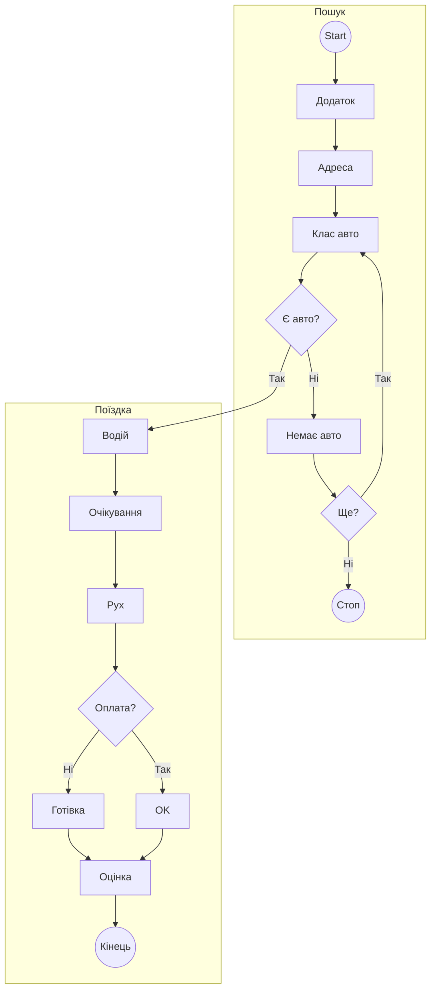
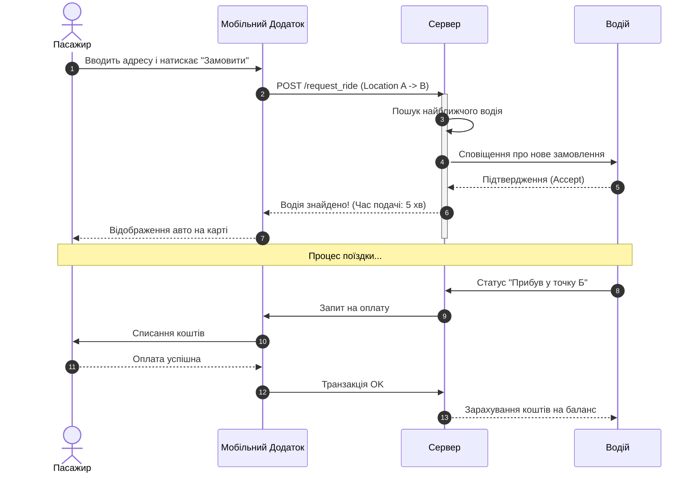
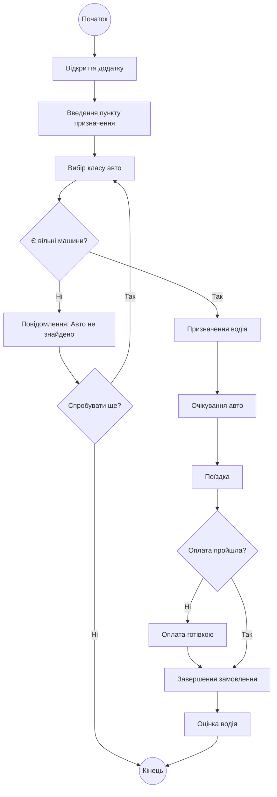

# Практична робота: Проєктування системи виклику таксі

## 1. Діаграма варіантів використання (Use Case Diagram)

Ця діаграма відображає основних користувачів (Пасажир, Водій, Адмін) та їхні можливості в системі.

## 2. Діаграма послідовності (Sequence Diagram)

Ця діаграма демонструє покрокову взаємодію між пасажиром, додатком, сервером та водієм під час замовлення.

## 3. Діаграма діяльності (Activity Diagram)

Ця діаграма показує алгоритм дій користувача та логіку системи (успішний пошук або відмова).

