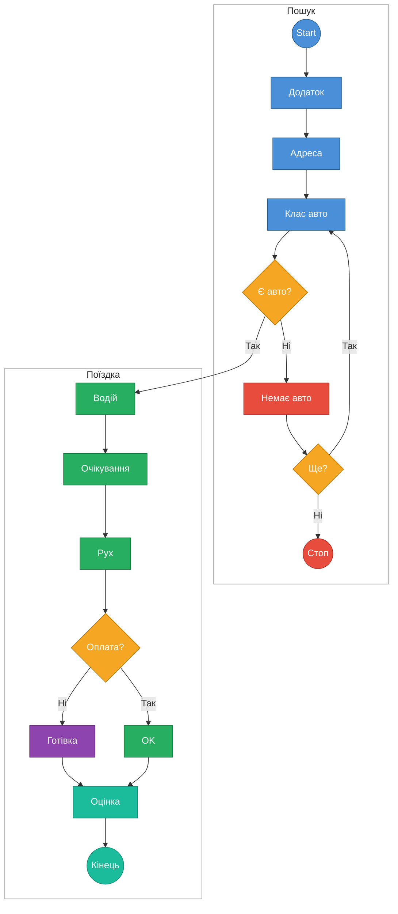
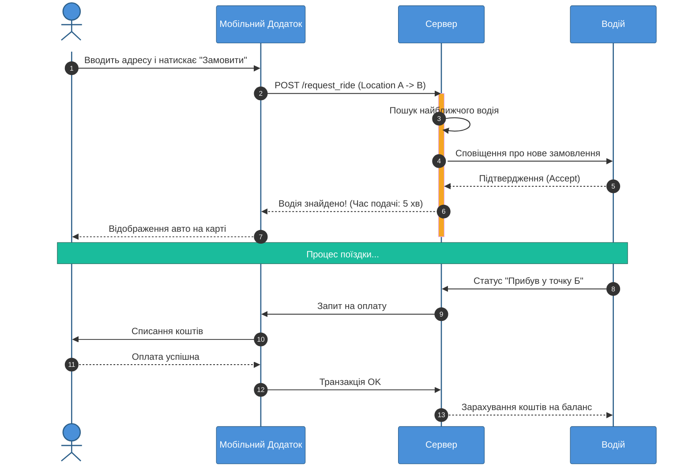
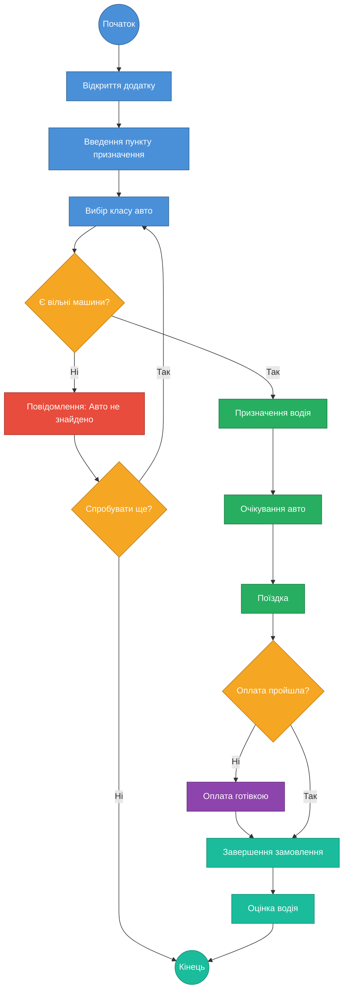

# Практична робота: Проєктування системи виклику таксі

## 1. Діаграма варіантів використання (Use Case Diagram)

## 2. Діаграма послідовності (Sequence Diagram)

## 3. Діаграма діяльності (Activity Diagram)
